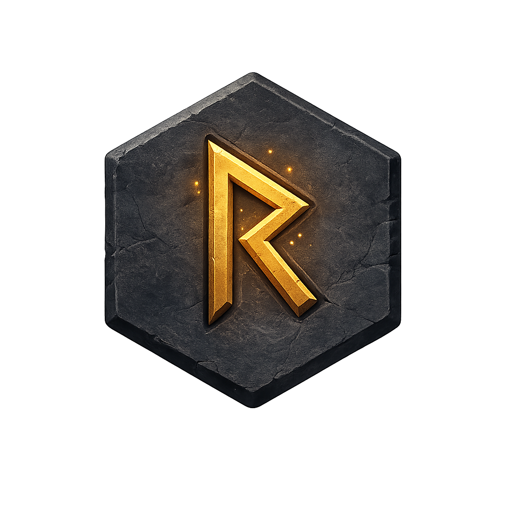
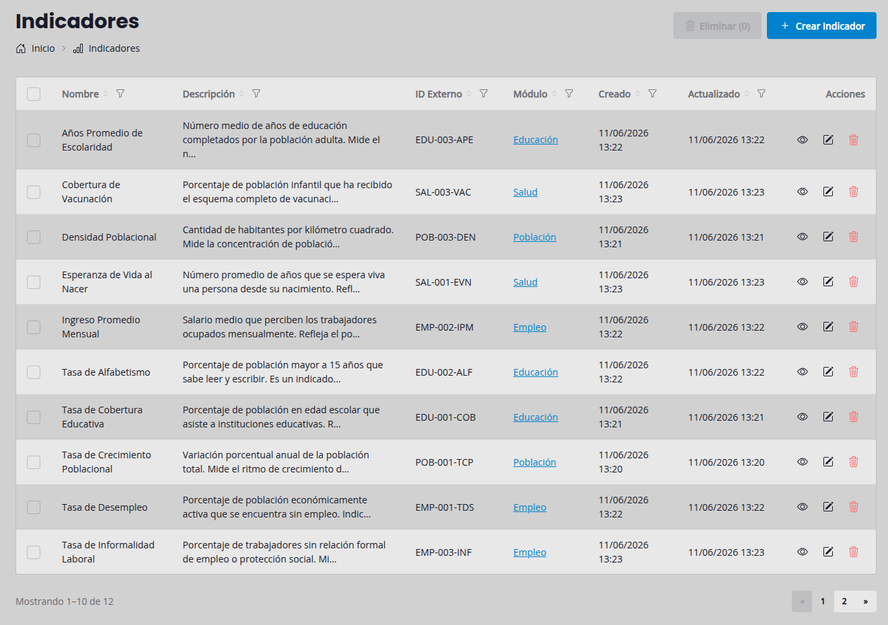

<div align="center">



# Runeforge

A SvelteKit toolkit that forges forms, tables, actions, and CRUD workflows from reusable definitions.



</div>

---

## Table of Contents

- [Introduction](#introduction)
- [Requirements](#requirements)
- [Key Features](#key-features)
- [Installation](#installation)
- [Basic Usage](#basic-usage)
  - [1. Define your interface and metadata](#1-define-your-interface-and-metadata)
  - [2. Create the model](#2-create-the-model)
  - [3. Set up the server](#3-set-up-the-server)
  - [4. Add the page component](#4-add-the-page-component)
- [Components](#components)
  - [GenericCRUD](#genericcrud)
  - [PaginatedTable](#paginatedtable)
  - [Form Components](#form-components)
  - [Shared Components](#shared-components)
- [Formatters](#formatters)
  - [`formatBoolean`](#formatboolean)
  - [`formatDatetime`](#formatdatetime)
  - [`formatTruncateTextUpTo`](#formattruncatetextupto)
  - [`formatInstance`](#formatinstance)
- [Custom Cell Components](#custom-cell-components)
  - [Example: avatar column](#example-avatar-column)
  - [Example: icon column](#example-icon-column)
- [Internationalization](#internationalization)
  - [Switch to English](#switch-to-english)
  - [Override individual strings](#override-individual-strings)
  - [Full `RuneforgeStrings` reference](#full-runeforgestrings-reference)
  - [Bundled locales](#bundled-locales)
- [Icon System](#icon-system)
- [Running Tests](#running-tests)
  - [Unit Tests](#unit-tests)
  - [End-to-End Tests](#end-to-end-tests)
  - [Run All Tests](#run-all-tests)
- [Development](#development)
- [License](#license)

---

## Introduction

Runeforge provides a set of composable, metadata-driven components for building data-heavy interfaces in SvelteKit. It handles the repetitive parts of CRUD UIs — listing records, creating and editing forms, sorting and filtering tables — through a declarative API built on top of [DaisyUI](https://daisyui.com/) and [Tailwind CSS](https://tailwindcss.com/).

---

## Requirements

- SvelteKit 2+
- Svelte 5 (runes mode)
- Tailwind CSS 4
- DaisyUI 5

---

## Key Features

- **GenericCRUD** — a single orchestrator component that wires together list, create, read, and update views from field and column definitions.
- **PaginatedTable** — a full-featured table with sorting, filtering, pagination, and row selection.
- **Field system** — declarative field definitions that drive both form rendering and display, supporting text, email, password, number, boolean, textarea, file, select, and datetime types.
- **Pluggable icon system** — swap the default icon set or use the included Bootstrap Icons alternative via `setIconSet`.
- **Standalone components** — table, form, and navigation components can be used independently without the full CRUD orchestrator.

---

## Installation

```bash
pnpm add runeforge
```

---

## Basic Usage

### 1. Define your interface and metadata

```ts
// interface.ts
import { AttributeType, type InterfaceMetadata } from 'runeforge';
import { formatBoolean, formatDatetime } from 'runeforge';

export interface IArticle {
  _id: string;
  title: string;
  published: boolean;
  createdAt: Date;
}

export const articleMeta = {
  title: {
    label: 'Title',
    type: AttributeType.text,
    placeholder: 'My article',
    required: true,
  },
  published: {
    label: 'Published',
    type: AttributeType.boolean,
    formatter: formatBoolean,
    default: false,
    required: true,
  },
  createdAt: {
    label: 'Created',
    type: AttributeType.datetime,
    formatter: formatDatetime(),
    excludedFromCreate: true,
    excludedFromUpdate: true
  },
  updatedAt: {
    label: 'Updated',
    type: AttributeType.datetime,
    formatter: formatDatetime(),
    excludedFromCreate: true,
    excludedFromUpdate: true
  },
} satisfies InterfaceMetadata<IArticle>;
```

Each metadata entry drives both the table column and the form field for that attribute. You can use `excludedFromList`, `excludedFromCreate`, `excludedFromRead`, or `excludedFromUpdate` to hide a field from specific views.

### 2. Create the model

```ts
// model.ts
import crypto from 'node:crypto';
import mongoose from 'mongoose';
import type { IArticle } from './interface';

const schema = new mongoose.Schema<IArticle>(
  {
    _id: { type: String, default: () => crypto.randomUUID() },
    title: { type: String, required: true, trim: true },
    published: { type: Boolean, required: true, default: false },
  },
  { timestamps: true }
);

export const Article = mongoose.models.Article ?? mongoose.model<IArticle>('Article', schema);
```

### 3. Set up the server

```ts
// +page.server.ts
import { fail, error } from '@sveltejs/kit';
import { Article } from '$lib/server/articles/model';
import type { Actions, PageServerLoad } from './$types';
import type { IArticle } from './interface';

export const load: PageServerLoad = async ({ url }) => {
  const id = url.searchParams.get('id');
  if (id) {
    const article = await Article.findById(id).lean<IArticle>();
    if (!article) error(404, 'Not found');
    return { article };
  }
  const articles = await Article.find({}).sort({ createdAt: -1 }).lean<IArticle[]>();
  return { articles };
};

export const actions: Actions = {
  create: async ({ request }) => {
    const data = await request.formData();
    const title = String(data.get('title') ?? '').trim();
    if (!title) return fail(400, { error: 'Title is required' });
    await Article.create({ title, published: data.has('published') });
    return { success: true };
  },

  update: async ({ request }) => {
    const data = await request.formData();
    const id = String(data.get('id') ?? '').trim();
    if (!id) return fail(400, { error: 'ID is required' });
    await Article.findByIdAndUpdate(id, {
      title: String(data.get('title') ?? '').trim(),
      published: data.has('published'),
    });
    return { success: true };
  },

  delete: async ({ request }) => {
    const data = await request.formData();
    const id = String(data.get('id') ?? '').trim();
    if (!id) return fail(400, { error: 'ID is required' });
    await Article.findByIdAndDelete(id);
    return { success: true };
  },
};
```

The `load` function returns a single record when `?id=` is present (used by the read/edit views), or the full list otherwise.

### 4. Add the page component

```html
<!-- +page.svelte -->
<script lang="ts">
  import { GenericCRUD } from 'runeforge';
  import { articleMeta as meta } from './interface';

  let { data, form } = $props();
</script>

<GenericCRUD
  labelOne="Article"
  labelMany="Articles"
  {data}
  {form}
  {meta}
  dataKey="articles"
  creation={{ endpoint: '?/create' }}
  read={{ endpoint: '?/read' }}
  update={{ endpoint: '?/update' }}
  deletion={{ endpoint: '?/delete' }}
/>
```

`dataKey` must match the key returned by the load function for the list. Each `endpoint` maps to a SvelteKit form action on the same page.

---

## Components

### GenericCRUD

The main CRUD orchestrator. It manages navigation between List, Create, Read, and Update views using URL search params (`?view=create`, `?id=xxx`, `?view=edit`).

Key props:

- `data` / `dataKey` — the record array and its primary key field
- `labelOne` / `labelMany` — singular and plural names for the entity
- `columns` — `ColumnDefinition[]` for the table view
- `fields` — `FieldDefinition[]` for form views
- `creation`, `update`, `read`, `deletion` — `ActionConfiguration` objects that define handlers and permissions for each operation

### PaginatedTable

A standalone table component with built-in sort, filter, and pagination.

```svelte
<script>
  import { PaginatedTable } from 'runeforge';
</script>

<PaginatedTable {data} {columns} />
```

Sort and filter state can be managed externally via the exported `SortState` and `FilterState` classes.

### Form Components

Individual form primitives styled with DaisyUI:

- `Button` — styled action button
- `Label` — form label with optional required marker
- `Select` — dropdown with option group support
- `PasswordInput` — password field with show/hide toggle

### Shared Components

- `Avatar` — user avatar display
- `Modal` — DaisyUI modal wrapper
- `Breadcrumbs` — navigation breadcrumb trail
- `IconRenderer` — renders icons from the active icon set

---

## Formatters

Formatters are functions you attach to a metadata field to control how its value is displayed in the table and read view. They follow a curried signature: `(data) => (value) => string`, where `data` is the full page data object (useful for resolving related records).

### `formatBoolean`

Converts a boolean to a readable label.

> [!INFO]
> Defaults to `Sí` / `No` because this was created at Argentina papá! 🇦🇷.

```ts
import { formatBoolean } from 'runeforge';

isActive: {
  label: 'Active',
  type: AttributeType.boolean,
  formatter: formatBoolean(),
  // or with custom labels:
  formatter: formatBoolean('Enabled', 'Disabled'),
},
```

### `formatDatetime`

Formats a `Date` value using the tokens `dd`, `mm`, `YYYY`, `HH`, `MM`, `ss`.

> [!INFO]
> Defaults to `'dd/mm/YYYY HH:MM'`.

```ts
import { formatDatetime } from 'runeforge';

createdAt: {
  label: 'Created',
  type: AttributeType.datetime,
  formatter: formatDatetime(),             // → "13/06/2026 09:45"
},

publishedAt: {
  label: 'Published',
  type: AttributeType.datetime,
  formatter: formatDatetime('dd/mm/YYYY'), // → "13/06/2026"
},
```

### `formatTruncateTextUpTo`

Truncates long text to a maximum character count, appending `…`.

```ts
import { formatTruncateTextUpTo } from 'runeforge';

description: {
  label: 'Description',
  type: AttributeType.textarea,
  formatter: formatTruncateTextUpTo(80),
},
```

### `formatInstance`

Resolves a foreign-key ID to a linked label. Receives the related records and the URL path for the detail view, and renders an anchor tag pointing to that record.

```ts
import { formatInstance } from 'runeforge';
import type { ICategory } from '$lib/server/categories/interface';

categoryId: {
  label: 'Category',
  type: AttributeType.select,
  options: (data: { categories?: ICategory[] }) =>
    (data.categories ?? []).map((c) => ({ value: c._id, label: c.name })),
  formatter: (data: { categories?: ICategory[] }) =>
    formatInstance<ICategory>('name', data.categories ?? [], '/admin/categories'),
},
```

---

## Custom Cell Components

Instead of a `formatter`, a metadata field can declare a `component` — a Svelte component that renders the cell in both the table list and the read view. This is useful when you need to render something visual, like an avatar image or an icon, rather than plain text.

A cell component receives two props defined by `CellProps<T, V>`:

- `value` — the raw field value for that cell
- `row` — the full record object, useful when the rendering depends on other fields

```ts
// CellProps interface (from runeforge)
interface CellProps<T extends object, V> {
  value: V;
  row: T;
}
```

### Example: avatar column

The following renders a user photo with a fallback to initials, using data from sibling fields on the row:

```svelte
<!-- components/UserAvatar.svelte -->
<script lang="ts">
  import { Avatar } from 'runeforge';
  import type { CellProps } from 'runeforge';

  type UserRow = { firstName?: string; lastName?: string; email?: string };

  let { value, row }: CellProps<UserRow, string | null> = $props();

  const initials = [row.firstName?.[0], row.lastName?.[0]].filter(Boolean).join('').toUpperCase();
</script>

<Avatar src={value} text={initials} alt={row.email ?? ''} />
```

Register it in the metadata with `component`:

```ts
// interface.ts
import UserAvatar from './components/UserAvatar.svelte';

export const userMeta = {
  photo: {
    label: 'Photo',
    type: AttributeType.file,
    component: UserAvatar,
    sortable: false,
    filterable: false,
  },
  // ...
} satisfies InterfaceMetadata<IUser>;
```

### Example: icon column

A simpler case — render a Bootstrap icon by name stored as a plain string:

```svelte
<!-- components/IconCell.svelte -->
<script lang="ts">
  import { IconRenderer } from 'runeforge';
  import type { CellProps } from 'runeforge';

  let { value }: CellProps<Record<string, unknown>, string> = $props();
</script>

<IconRenderer name={value} />
```

```ts
icon: {
  label: 'Icon',
  type: AttributeType.text,
  component: IconCell,
},
```

> [!TIP]
> Both `AvatarCell` and `IconCell` are included in the package and ready to use — you don't need to build them from scratch:
>
> ```ts
> import { AvatarCell, IconCell } from 'runeforge';
>
> photo: { label: 'Photo', type: AttributeType.file, component: AvatarCell },
> icon:  { label: 'Icon',  type: AttributeType.text, component: IconCell  },
> ```

---

## Internationalization

All UI strings default to **Spanish** (Argentina). To switch to another language, call `setStrings` in your root layout with a full or partial `RuneforgeStrings` object. Values you omit fall back to the Spanish defaults.

### Switch to English

```svelte
<!-- +layout.svelte -->
<script>
  import { setStrings, en } from 'runeforge';

  setStrings(en);
</script>
```

### Override individual strings

```svelte
<script>
  import { setStrings } from 'runeforge';

  setStrings({
    create: 'New',
    save: 'Confirm',
    required: (field) => `${field} cannot be blank`,
  });
</script>
```

### Full `RuneforgeStrings` reference

| Key | Type | Spanish default |
| --- | --- | --- |
| `showing` | `(start, end, total) => string` | `Mostrando 1–10 de 25` |
| `actions` | `string` | `Acciones` |
| `filter` | `string` | `Filtrar` |
| `filterColumn` | `(column) => string` | `Filtrar Nombre` |
| `filterPlaceholder` | `string` | `Filtrar…` |
| `clearFilter` | `string` | `Limpiar filtro` |
| `emptyValue` | `string` | `(vacío)` |
| `previous` | `string` | `Anterior` |
| `next` | `string` | `Siguiente` |
| `selectPlaceholder` | `string` | `Seleccioná una opción` |
| `selectSearch` | `string` | `Buscar...` |
| `selectNoResults` | `string` | `Sin resultados` |
| `view` | `string` | `Ver` |
| `edit` | `string` | `Editar` |
| `delete` | `string` | `Eliminar` |
| `create` | `string` | `Crear` |
| `save` | `string` | `Guardar` |
| `saveAndContinue` | `string` | `Guardar y continuar` |
| `cancel` | `string` | `Cancelar` |
| `back` | `string` | `Volver` |
| `required` | `(field) => string` | `Título es requerido` |
| `serverError` | `string` | `Error inesperado del servidor.` |

> [!INFO]
> Defaults to Spanish because this was built in Argentina! 🇦🇷

### Bundled locales

| Import | Language |
| --- | --- |
| `es` | Spanish 🇦🇷 (default) |
| `en` | English 🇺🇸 |

---

## Icon System

Runeforge ships with a default icon set. To use Bootstrap Icons instead:

```svelte
<script>
  import { setIconSet } from 'runeforge';
  import bootstrapIcons from 'runeforge/icons/bootstrap';

  setIconSet(bootstrapIcons);
</script>
```

You can also provide a fully custom icon set by passing an object that satisfies the icon set interface.

---

## Running Tests

### Unit Tests

Unit tests cover utility functions (formatters, resolution helpers, misc utilities) and run with [Vitest](https://vitest.dev/).

```bash
# Single run
pnpm test:unit

# Watch mode
pnpm test:unit:watch
```

### End-to-End Tests

E2E tests cover table interactions (pagination, sorting, filtering) and run with [Playwright](https://playwright.dev/). The dev server starts automatically when running locally.

```bash
pnpm test:e2e
```

### Run All Tests

```bash
pnpm test
```

---

## Development

```bash
# Start the dev server
pnpm dev

# Type-check
pnpm check

# Lint and format
pnpm lint
pnpm format

# Build the library
pnpm build
```

---

## License

MIT
